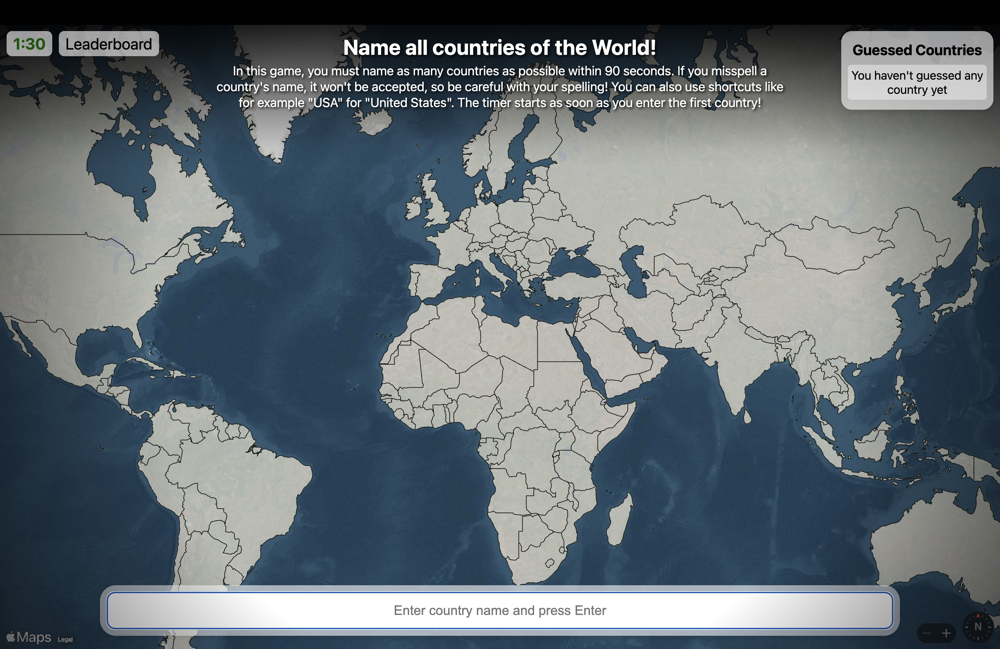

# 🌍 GlobeRush – Name as many countries as possible in 1:30!

## Project Description
GlobeRush is a fun and educational game where you must name as many countries as possible within 90 seconds. Be careful with your spelling, as misspelled country names won't be accepted. The timer starts as soon as you enter the first country! You can also use shortcuts like "USA" for "United States of America" and "UK" for "United Kingdom".

The game features a world map created with MapKit JS and GeoJSON. When you correctly name a country, it will be highlighted in green on the map. Additionally, there is a leaderboard that tracks the players who have named the most countries. The game also shows how well you performed compared to other players, for example, "You guessed 21 countries, that is better than 98% of the players."

## Demo
[https://globe-rush.alex.polan.sk/](https://globe-rush.alex.polan.sk/)

## Features
- Name as many countries as possible within 90 seconds.
- Supports common country name abbreviations (e.g., "USA" for "United States of America", "UK" for "United Kingdom"). - This was a little bit tricky to make.
- Real-time feedback on correct and incorrect entries.
- World map created with MapKit JS and GeoJSON.
- Correctly named countries are highlighted in green on the map.
- Leaderboard to track top players.
- Performance comparison with other players. - For example: "You guessed 21 countries, that is better than 98% of the players."

## How to use


## Technical Stack

### Backend
- PHP
- MySQL
- GeoJSON

### Frontend
- MapKit JS
- Vue.js
- HTML
- JavaScript
- CSS

## Screenshots



## Project setup
```
npm install
```

### Compiles and hot-reloads for development
```
npm run serve
```

### Compiles and minifies for production
```
npm run build
```

### Lints and fixes files
```
npm run lint
```

### Customize configuration
See [Configuration Reference](https://cli.vuejs.org/config/).

## Credits
Geojson - https://geojson-maps.kyd.au
